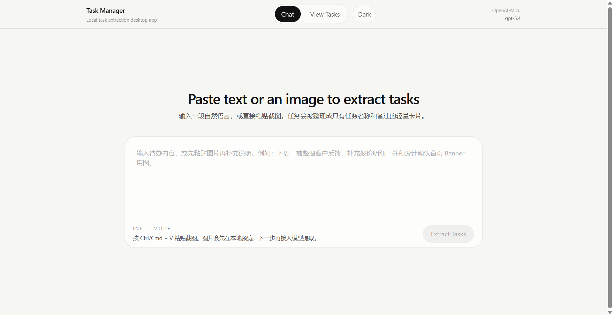

# Task Manager 2.0

一个本地优先的桌面任务提取工具，基于 `Tauri + React + TypeScript` 构建。

它只解决一件事：把自由输入的文本或图片，快速整理成结构化任务卡片。

[English](./README.en.md) | [仓库首页](./README.md)

## 项目简介

Task Manager 2.0 的核心流程非常简单：

1. 输入文本或粘贴图片
2. 调用根目录 `config.json` 中配置的大模型
3. 提取任务
4. 生成任务卡片
5. 本地保存任务

当前产品有意保持极简，不做完整项目管理系统。

## 功能特性

1. 基于 `Tauri` 的本地桌面运行
2. 支持文本输入
3. 支持粘贴图片输入
4. 根目录 `config.json` 配置模型供应商
5. 通过 OpenAI-compatible 接口调用模型
6. 每次输入只提取一条任务
7. `note` 以键值对形式输出，例如：

```txt
时间：下周二
地点：318教室
要求：带上纸质资料
```

8. 支持浅色/深色模式切换
9. 任务本地持久化到 `tasks.json`

## 界面结构

当前界面包含两个主视图：

1. `Chat`
   - 默认启动页
   - 类似 ChatGPT Web 的居中输入界面
   - 支持文本输入与图片粘贴

2. `View Tasks`
   - 默认只显示任务名称
   - 点击某一项后展开 `note`
   - 支持删除任务

## 技术栈

1. `Tauri`
2. `React`
3. `TypeScript`
4. `Vite`
5. `Tailwind CSS`
6. `zod`

## 目录结构

```txt
.
├─ config.json
├─ README.md
├─ README.zh-CN.md
├─ README.en.md
├─ Task Board.md
├─ src/
│  ├─ app/
│  ├─ components/
│  ├─ config/
│  ├─ features/
│  │  ├─ extraction/
│  │  └─ tasks/
│  ├─ hooks/
│  └─ types/
└─ src-tauri/
```

## 环境要求

运行本项目前，请确保本机已安装：

1. Node.js 22+
2. npm 11+
3. Rust
4. Cargo
5. Tauri 所需本地构建环境

## 安装

```bash
npm install
```

## 配置

项目根目录必须存在 `config.json`。

示例：

```json
{
  "providers": {
    "openai-main": {
      "name": "OpenAI-Micu",
      "npm": "@ai-sdk/openai",
      "models": {
        "gpt-5.4": {
          "name": "gpt-5.4"
        }
      },
      "options": {
        "apiKey": "YOUR_API_KEY",
        "imageInputEnabled": true,
        "setCacheKey": true,
        "baseURL": "https://your-openai-compatible-endpoint/v1",
        "headers": {
          "Authorization": "Bearer YOUR_API_KEY"
        }
      }
    }
  },
  "activeProvider": "openai-main",
  "activeModel": "gpt-5.4"
}
```

### 配置规则

1. `activeProvider` 必须存在于 `providers`
2. `activeModel` 必须存在于 `providers[activeProvider].models`
3. `apiKey` 不能为空
4. `baseURL` 必须是合法 URL
5. 当前实现只支持 `npm: "@ai-sdk/openai"`
6. `imageInputEnabled` 控制是否允许图片输入

## 运行

浏览器开发模式：

```bash
npm run dev
```

桌面开发模式：

```bash
npm run tauri:dev
```

前端构建：

```bash
npm run build
```

桌面打包：

```bash
npm run tauri:build
```

## 提取规则

当前提取逻辑包含这些限制：

1. 每次输入有且仅有一条任务
2. 不允许创建多条任务
3. 若输入中有多个动作，模型需要合并为一条主任务
4. `note` 以键值对多行文本输出
5. 输出必须是合法 JSON

## 输出示例

```txt
任务名称：提交美国宗教术语整理

备注：
时间：下次上课前
对象：小组作业
背景：教材《美国宗教》章节
要求：整理相关术语并提交
```

## 数据持久化

桌面模式下，任务不会只保存在浏览器 `localStorage` 中。

当前版本会：

1. 将任务写入本机应用数据目录中的 `tasks.json`
2. 在关闭程序后继续保留任务
3. 在重新启动时自动恢复任务
4. 尝试将旧版 `localStorage` 数据迁移到 `tasks.json`

## 已知限制

1. 当前只支持单任务提取
2. 当前只兼容 OpenAI-compatible 接口
3. 当前任务字段只有 `title` 和 `note`
4. 当前 `View Tasks` 只支持展开查看和删除，不支持完整编辑
5. 某些模型网关若返回非标准 JSON，仍可能需要继续兼容

## 常见问题

### 1. `Failed to load config.json`

请检查：

1. 根目录是否存在 `config.json`
2. JSON 格式是否正确
3. `baseURL` 是否合法

### 2. 提取时报 JSON 解析错误

可能原因：

1. 模型未严格按 JSON 输出
2. 网关返回格式不完全兼容

当前项目已经包含一层 JSON 修复逻辑，但若仍失败，建议进一步查看模型原始响应。

### 3. 关闭程序后任务丢失

当前版本已经改成 Tauri 本地文件持久化。

如果仍丢失，请确认：

1. 是否通过 `npm run tauri:dev` 启动桌面版
2. 本地应用数据目录是否有写入权限

## Roadmap

后续可扩展方向：

1. SQLite 持久化
2. 任务编辑功能
3. 导出 `tasks.json`
4. 更多模型供应商适配
5. 本地模型支持
6. 批量图片导入

## 安全说明

1. 根目录 `config.json` 当前允许明文 API Key
2. 不建议把真实密钥提交到公开仓库
3. 若后续开源发布，建议改为占位符或增加环境变量覆盖
